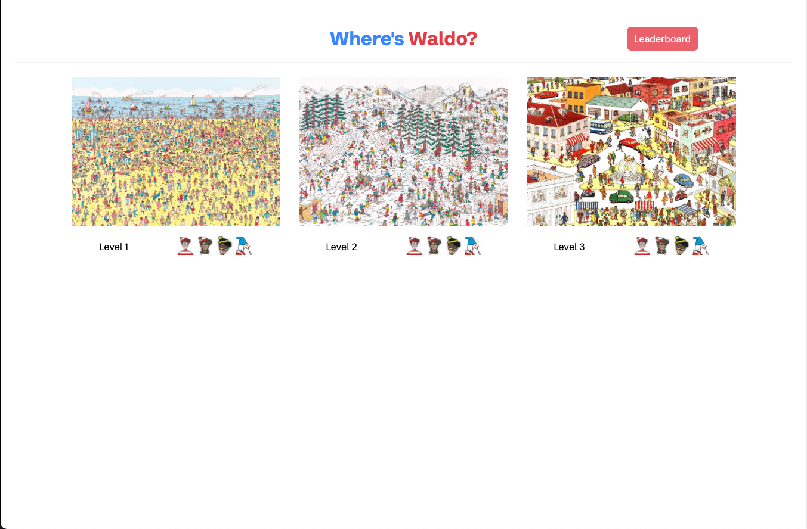
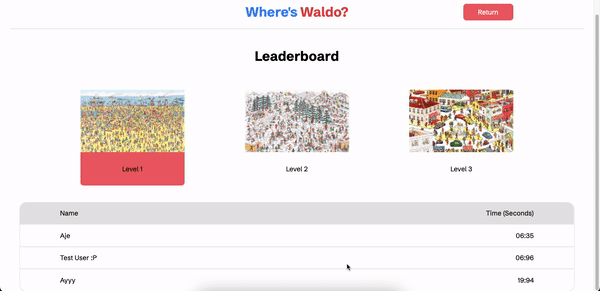

# Where's Waldo?
Where's Waldo is a React Project that aims to replicate the classic "Where's Waldo" game while also incorporating a realtime, backend database. React is used to build the project while Firebase is used for authentication and storing high scores. 
Firebase Hosting Link: https://where-is-waldo-64ca4.web.app

## Features
- Multiple selectable levels
- Background stopwatch to track how long player takes to complete a level
- High score leaderboard with backend data storage and annoymous authentication for players

## Built With
- React
- Firebase